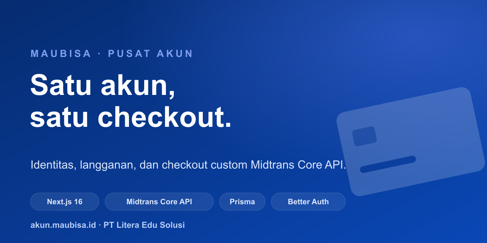

<div align="center">

<picture>
  <source media="(prefers-color-scheme: dark)" srcset="./.github/assets/maubisa-logo-white.png">
  
</picture>

# Account Center Starter

**Satu halaman akun untuk semua produk Anda, lengkap dengan halaman pembayarannya sendiri.**

Bangun pusat akun sekali, pakai di semua layanan: satu login untuk semua produk, kelola langganan
dan hak akses, plus halaman bayar (Midtrans) yang tampilannya mengikuti merek Anda. Kode ini kami
pakai sungguhan di `akun.maubisa.id`, lalu kami buka agar Anda tidak perlu mulai dari nol.

<p>
  <a href="https://demo-akun.maubisa.id"></a>
  <a href="https://github.com/maubisa-id/account-center-starter/generate"></a>
</p>

[](https://vercel.com/new/clone?repository-url=https://github.com/maubisa-id/account-center-starter&env=DATABASE_URL,DB_PROVIDER,BETTER_AUTH_SECRET,BETTER_AUTH_URL,NEXT_PUBLIC_DEMO_MODE&envDescription=Database%20terkelola%20%2B%20rahasia%20auth%20(build%20menjalankan%20prisma%20db%20push)&envLink=https://github.com/maubisa-id/account-center-starter/blob/main/.env.example)

<p>
  <a href="https://github.com/maubisa-id/account-center-starter/actions/workflows/ci.yml"></a>
  <a href="https://github.com/maubisa-id/account-center-starter/releases/latest"></a>
  <a href="./LICENSE"></a>
  <a href="https://github.com/maubisa-id/account-center-starter/commits/main"></a>
</p>

<p>
  <a href="https://nextjs.org/"></a>
  <a href="https://react.dev/"></a>
  <a href="https://www.typescriptlang.org/"></a>
  <a href="https://tailwindcss.com/"></a>
  <a href="https://www.prisma.io/"></a>
  <a href="https://www.better-auth.com/"></a>
  <a href="https://docs.midtrans.com/"></a>
</p>

<br/>



</div>

---

> [!TIP]
> **Coba dulu sebelum dipakai: [demo-akun.maubisa.id](https://demo-akun.maubisa.id).**
> Masuk sebagai user `budi@example.com` atau admin `admin@example.com` (sandi `password123` untuk
> keduanya), atau daftar akun baru lalu buka [kotak email demo](https://demo-akun.maubisa.id/demo/kotak)
> untuk melihat email yang masuk (kode OTP, ucapan selamat datang). Semua pembayaran memakai mode
> sandbox, jadi aman dicoba tanpa uang asli.

## Untuk siapa ini

Pakai starter ini kalau Anda butuh salah satu dari berikut:

- Halaman akun untuk pelanggan: login, profil, keamanan.
- Dashboard langganan dan hak akses.
- Halaman pembayaran sendiri (kartu, QRIS, Virtual Account, e-wallet) yang tampilannya sama di
  semua produk.

Anda tidak perlu jadi ahli pembayaran. Bagian yang paling rawan, yaitu checkout dan pengecekan
bayar, sudah kami tangani. Anda tinggal ganti merek, isi produk, dan pasang kunci Midtrans.

## Kenapa ada

Membuat halaman akun yang utuh itu makan waktu: login, keamanan dua langkah, kelola langganan,
tagihan, dan yang paling sulit, sistem pembayaran yang tidak gampang diakali. Semua itu sudah jadi
di sini, siap Anda pakai ulang.

> [!NOTE]
> Halaman bayar dibuat sendiri memakai **Midtrans Core API**, bukan halaman standar "Snap" bawaan
> Midtrans, jadi tampilannya benar-benar menyatu dengan merek Anda. Metode yang didukung: QRIS,
> GoPay, ShopeePay, Virtual Account (BCA, BNI, BRI, Permata, CIMB), Mandiri Bill, dan kartu
> kredit/debit dengan verifikasi OTP (3D Secure). Tersedia juga link pembayaran dan langganan
> otomatis.

## Fitur

- **Login dan keamanan akun.** Daftar dan masuk, verifikasi email lewat OTP, lupa kata sandi,
  keamanan dua langkah (2FA), lihat dan keluarkan perangkat yang sedang login, dan ganti kata sandi.
  Sudah termasuk pelindung anti-bot (Cloudflare Turnstile).
- **Halaman bayar sendiri.** Tampilan bayar yang menyatu dengan merek Anda, untuk pengguna yang
  sudah login maupun tamu. QR atau nomor Virtual Account tampil langsung di halaman, status dicek
  otomatis, verifikasi kartu (3D Secure) tanpa pindah halaman, simpan kartu untuk sekali klik, dan
  deteksi bank dari nomor kartu.
- **Langganan.** Lihat status dan masa aktif, berhenti di akhir periode, ganti paket, dan
  perpanjang otomatis (kartu) atau manual (QRIS dan VA).
- **Hak akses.** Satu login untuk semua layanan (SSO), plus rincian apa saja yang bisa diakses.
- **Email otomatis.** Kode OTP, ucapan selamat datang, info akses setelah bayar, pengingat menunggu
  bayar, struk, dan pemberitahuan saat bayar gagal. Tidak ada email dobel.
- **Beli tanpa daftar dulu.** Orang bisa langsung bayar. Akunnya dibuat otomatis setelah lunas,
  lalu dikirim tautan untuk mengatur kata sandi sendiri.
- **Privasi (UU PDP).** Pengguna bisa mengunduh datanya (JSON) dan menghapus akun.
- **Buat akun dari sistem lain.** Jalur aman agar website atau aplikasi lain bisa membuatkan akun
  setelah pembelian.
- **Panel admin.** Dibuka lewat allowlist email (`ADMIN_EMAILS`): ringkasan pendapatan dan tunggakan,
  telusuri pengguna beserta langganan/tagihan/akses, buat Payment Link, pendaftar acara (gabungan
  gratis dari CMS dan berbayar) dengan ekspor CSV, cetak invoice pelanggan, pencarian global, dan
  filter per lini layanan. Bisa beri/cabut hak akses manual, semua tercatat di **jejak audit**.
- **Keamanan operator.** Verifikasi dua langkah (2FA) untuk akses admin bersifat fail-closed di
  produksi (`ADMIN_REQUIRE_MFA`), dan jejak audit mencatat aksi sensitif (beri/cabut akses, buat
  Payment Link, ekspor data, hapus akun) selaras dengan PCI DSS, ISO 27001, SOC 2, dan UU PDP.

## Cara kerjanya

```
Web / App / Kelas  --"Beli"-->  Account Center  --charge-->  Midtrans Core API
  (kirim kode barang,           (hitung harga,               (QRIS / VA / e-wallet /
   bukan harga)                  proses checkout)             kartu 3DS)
                                       ^                           |
                                       |    webhook (dicek         |
                                       +---- keaslian + anti  -----+
                                             dobel)
                              akses dibuka setelah bayar benar-benar lunas
```

Aturan intinya: produk lain cukup mengirim kode barang, bukan harga. Harga selalu dihitung di
server ini, pembayaran diproses, lalu akses dibuka hanya setelah Midtrans memastikan bayarnya lunas.

## Tech stack

| Bagian | Teknologi |
|--------|-----------|
| Framework | [Next.js 16](https://nextjs.org/) (App Router, Server Components, Turbopack) |
| UI | [React 19](https://react.dev/) + [Tailwind CSS v4](https://tailwindcss.com/) |
| Bahasa | [TypeScript](https://www.typescriptlang.org/) (strict) |
| ORM | [Prisma 6](https://www.prisma.io/) (SQLite untuk dev, MySQL atau PostgreSQL untuk produksi) |
| Auth | [Better Auth 1.6](https://www.better-auth.com/) (email + password, 2FA, OTP) |
| Pembayaran | [Midtrans Core API](https://docs.midtrans.com/) plus Payment Link dan Subscription |
| Email | [Nodemailer](https://nodemailer.com/) (transaksional) |
| Konten acara | [Directus](https://directus.io/) (opsional, ada fallback contoh) |
| Monitoring | [Sentry](https://sentry.io/) (errors-only, hemat kuota) |

## Mulai cepat

Pilih salah satu cara memakai kode ini:

- **Tombol "Use this template"** (paling gampang): bikin repo baru milik Anda dengan riwayat bersih,
  [buka di sini](https://github.com/maubisa-id/account-center-starter/generate).
- **Salin langsung jadi folder baru** (tanpa membawa riwayat git):
  ```bash
  npx degit maubisa-id/account-center-starter nama-proyek-anda
  cd nama-proyek-anda
  ```
- **Fork lewat tombol di GitHub** kalau ingin tetap terhubung ke sumbernya, supaya gampang menarik
  pembaruan nanti.

Lalu jalankan:

```bash
npm install
cp .env.example .env          # minimal isi BETTER_AUTH_SECRET (openssl rand -base64 32)
npx prisma db push            # buat dev.db + tabel dari prisma/schema.prisma
npm run seed                  # data contoh + akun demo
npm run dev                   # http://localhost:3000
```

**Akun demo:** user `budi@example.com` (punya langganan, tagihan, dan hak akses contoh) atau admin
`admin@example.com` (login lalu mendarat di `/admin`). Sandi keduanya `password123`.

Butuh Node 22 (lihat [`.nvmrc`](./.nvmrc)). Tanpa kunci Midtrans pun aplikasi tetap jalan: fitur
pembayaran menampilkan status "belum tersedia", bukan error.

## Environment

Semua variabel dijelaskan di [`.env.example`](./.env.example). Yang paling penting:

| Variabel | Wajib | Keterangan |
|----------|:-----:|------------|
| `DATABASE_URL` + `DB_PROVIDER` | ya | `file:./dev.db` (dev) atau `mysql://` / `postgresql://` (produksi) |
| `BETTER_AUTH_SECRET` / `BETTER_AUTH_URL` | ya | rahasia acak plus origin app |
| `MIDTRANS_SERVER_KEY` | untuk bayar | server key (rahasia) |
| `NEXT_PUBLIC_MIDTRANS_CLIENT_KEY` | untuk kartu | client key (wajib untuk kartu dan 3DS) |
| `TURNSTILE_SECRET_KEY` | di produksi | anti-bot; wajib di produksi (app tidak boot tanpa kunci) |
| `MAIL_*` | untuk email | SMTP; kalau kosong, email dicetak ke konsol saat dev |
| `PROVISION_SECRET` | untuk provisioning | shared secret dari sistem yang memanggil |
| `DIRECTUS_URL` / `DIRECTUS_TOKEN` | untuk acara | sumber data acara (opsional) |

> [!IMPORTANT]
> **Harga selalu ditentukan di server, bukan dari halaman atau browser.** Nilai bayar tidak pernah
> diambil dari sisi pengguna, jadi tidak bisa diakali. Akses baru terbuka setelah Midtrans mengabari
> bahwa pembayaran benar-benar lunas, dan pesan itu dicek keasliannya lebih dulu.

## Deploy ke Vercel

Klik tombol **Deploy with Vercel** di atas. Saat impor, Vercel otomatis meminta env **wajib**
berikut (build menjalankan `prisma db push`, jadi database harus siap sejak build pertama):

- `DATABASE_URL` dan `DB_PROVIDER` — pakai database terkelola (Neon, Supabase, PlanetScale,
  Railway) untuk deploy yang persisten. `file:./dev.db` + `sqlite` bisa untuk demo cepat, tapi di
  serverless datanya sementara (tiap invocation terisolasi) — cukup untuk pratinjau, bukan produksi.
- `BETTER_AUTH_SECRET` (rahasia acak) dan `BETTER_AUTH_URL` (isi domain Vercel final setelah rilis
  pertama, lalu deploy ulang).
- `NEXT_PUBLIC_DEMO_MODE` — isi `1` untuk demo publik (checkout sandbox, mailbox demo), kosongkan
  untuk produksi.

Env opsional lain (isi dari `.env.example` sesuai kebutuhan) bisa ditambahkan di Settings → Environment
Variables kapan saja:

- `MIDTRANS_IS_PRODUCTION`, `MIDTRANS_SERVER_KEY`, `NEXT_PUBLIC_MIDTRANS_CLIENT_KEY` untuk pembayaran
- `TURNSTILE_SECRET_KEY` dan `NEXT_PUBLIC_TURNSTILE_SITE_KEY` untuk proteksi form di produksi
- `MAIL_HOST`, `MAIL_PORT`, `MAIL_USERNAME`, `MAIL_PASSWORD`, `MAIL_FROM_*`, `MAIL_REPLYTO_*` untuk email
- `DIRECTUS_URL`, `DIRECTUS_TOKEN`, `DIRECTUS_EVENTS_COLLECTION` bila memakai CMS acara
- `PROVISION_SECRET`, `ADMIN_EMAILS`, `NEXT_PUBLIC_*_URL`, dan `NEXT_PUBLIC_*_ENABLED` sesuai layanan

`vercel.json` sudah menjalankan `node scripts/db-provider.mjs && prisma generate && prisma db push && next build`.
Setelah rilis pertama, set `BETTER_AUTH_URL` ke domain Vercel final lalu deploy ulang.

> [!WARNING]
> **Tidak bisa login / error 500 di Vercel?** Dua penyebab paling umum:
>
> 1. **SQLite tidak jalan di serverless.** `DATABASE_URL=file:./dev.db` hanya untuk lokal —
>    filesystem Vercel bersifat sementara & read-only, jadi Better Auth gagal menulis sesi
>    (endpoint `/api/auth/*` balas 500). Pakai database terkelola (mis. [Neon](https://neon.tech)
>    gratis), lalu set `DATABASE_URL=postgresql://...` + `DB_PROVIDER=postgresql` +
>    `BETTER_AUTH_SECRET` (acak) + `BETTER_AUTH_URL=https://<domain-vercel-anda>`, dan deploy ulang.
> 2. **Belum ada akun.** `prisma db push` hanya membuat tabel, bukan data. Untuk akun demo
>    (`budi@example.com` / `admin@example.com`, sandi `password123`), jalankan seed **sekali**
>    menunjuk ke DB terkelola Anda:
>    ```bash
>    DATABASE_URL="postgresql://...anda..." DB_PROVIDER=postgresql npm run seed
>    ```
>    Atau lewati seed dan daftar akun baru di `/daftar` (pakai sandi kuat — `password123` ditolak
>    saat daftar karena masuk daftar sandi lemah; ia hanya dipakai akun demo hasil seed). Untuk
>    akses admin, isi `ADMIN_EMAILS` dengan email yang Anda daftarkan.


## Buat jadi milik Anda

Repo tetap membawa identitas Maubisa sebagai asal template, sementara isi produk demo sudah netral.
Untuk menjadikannya milik sendiri:

1. **Ganti merek aplikasi.** Logo lewat `NEXT_PUBLIC_LOGO_URL` (atau aset di
   [`.github/assets/`](./.github/assets) untuk repo), warna `brand-*` di `src/app/globals.css`,
   serta nama pengirim email di `MAIL_FROM_*`. Untuk kartu social preview, ubah `CARDS` di
   [`scripts/make-og.mjs`](./scripts/make-og.mjs) lalu jalankan `npm run og`.
2. **Sesuaikan sinyal kepercayaan.** Badan hukum, nomor WhatsApp, dan testimoni di
   `src/components/pay/checkout-trust.tsx` serta `src/lib/testimonials.ts`.
3. **Ganti lini layanan.** Label scope internal ada di `src/lib/service-lines.ts`; kunci
   `thesis|app|kelas|book` sengaja tetap agar seed, DB, dan katalog tidak pecah.
4. **Atur katalog dan harga.** Produk contoh ada di `prisma/seed.ts` (`membership-pro`,
   `webinar-sample`, `consult-basic`, `consult-plus`, `course-sample`), metadata kartu di
   `src/lib/catalog.ts`, dan harga produksi di database. Harga tetap dihitung di server.
5. **Isi kunci Midtrans Anda.** Dari [dashboard Midtrans](https://dashboard.midtrans.com/), pakai
   Sandbox untuk uji dan Production saat rilis, lalu masukkan ke `.env`.
6. **Deploy.** Cara tercepat: tombol **Deploy with Vercel** di atas. Bawa database terkelola sendiri
   (misalnya [Neon](https://neon.tech) atau [Supabase](https://supabase.com)); `vercel.json` sudah
   mengatur `prisma db push` dan `next build` otomatis. Setelah rilis pertama, set `BETTER_AUTH_URL`
   ke domain final Anda lalu deploy ulang. Untuk MySQL/PostgreSQL manual atau Docker, lihat
   [docs/produksi-mysql.md](./docs/produksi-mysql.md); `Dockerfile` tersedia di root.

> [!TIP]
> [`PRODUCT.md`](./PRODUCT.md) dan [`DESIGN.md`](./DESIGN.md) berisi konteks produk dan sistem desain
> Maubisa sebagai contoh. Ganti dengan milik Anda supaya keputusan tampilan tetap konsisten.

Panduan kontribusi dan standar kode ada di [CONTRIBUTING.md](./CONTRIBUTING.md).

## Struktur proyek

```
src/
  app/
    (app)/           # area login: ringkasan, profil, keamanan, langganan,
                     # metode-pembayaran, pembayaran, acara, akses, notifikasi, privasi
    beli, checkout, bayar/[orderId], terima-kasih   # alur checkout (tamu dan login)
    masuk, daftar, lupa-password, reset-password, 2fa
    api/
      auth/[...all]           # Better Auth
      pay/                    # charge, charge/guest, status, cancel, bin, link, resend
      webhook/midtrans        # aktivasi akses (signature + idempotent; sekali bayar dan berulang)
      provision               # dipanggil sistem lain setelah pembelian
      payment-methods         # kartu tersimpan (One Click)
  components/        # shell, ui, dashboard/*, pay/*, shared-assets/credit-card/*
  lib/               # auth, prisma, midtrans/* (Core API + subscription + link + bin),
                     # midtrans-card (3DS), order-id, payment-methods, recurring, email, format
prisma/              # schema.prisma, seed.ts
test/                # Vitest (unit): signature, order-id, safe-redirect, status, guest-order
```

## Skrip

| Skrip | Fungsi |
|-------|--------|
| `npm run dev` | server pengembangan (Turbopack) |
| `npm run build` / `npm start` | build dan jalankan produksi |
| `npm run lint` | ESLint |
| `npm run test` | Vitest (unit) |
| `npm run seed` | isi data contoh dan akun demo |
| `npm run test:webhook` | uji webhook Midtrans lokal (end-to-end, tanpa tunnel) |

## Keamanan

Bagian pembayaran dibuat ekstra hati-hati: setiap pemberitahuan dari Midtrans dicek keasliannya
dulu, proses yang sama tidak dihitung dua kali, status pembayaran tidak bisa mundur, dan nominalnya
selalu dicocokkan dengan tagihan. Nomor kartu dan CVV tidak pernah kami simpan, karena pemrosesan
kartu sepenuhnya ditangani Midtrans. Detail teknis dan cara melapor ada di [SECURITY.md](./SECURITY.md).

## Dokumentasi

| Dokumen | Isi |
|---------|-----|
| [PANDUAN-DEMO.md](./PANDUAN-DEMO.md) | Cara memasang demo online (database, Sandbox, reset) |
| [PRODUCT.md](./PRODUCT.md) | Konteks produk dan audiens |
| [DESIGN.md](./DESIGN.md) | Sistem desain dan keputusan visual |
| [SECURITY.md](./SECURITY.md) | Kebijakan keamanan dan checklist produksi |
| [SUPPORT.md](./SUPPORT.md) | Cara mendapat bantuan dan melapor masalah |
| [SENTRY-RUNBOOK.md](./SENTRY-RUNBOOK.md) | Runbook monitoring error |
| [docs/produksi-mysql.md](./docs/produksi-mysql.md) | Deploy ke MySQL atau PostgreSQL |
| [CONTRIBUTING.md](./CONTRIBUTING.md) | Cara berkontribusi dan standar kode |
| [CHANGELOG.md](./CHANGELOG.md) | Riwayat perubahan |

## Kredit & Atribusi

Template ini berasal dari [`maubisa-id/account-center-starter`](https://github.com/maubisa-id/account-center-starter)
oleh Maubisa / PT Litera Edu Solusi. Kalau Anda memakai atau memodifikasi starter ini, kami akan senang
kalau atribusi dan tautan asalnya tetap dicantumkan agar pengguna lain bisa menemukan sumbernya.

## Lisensi

[MIT](./LICENSE), hak cipta 2026 PT Litera Edu Solusi (Maubisa). Singkatnya: bebas dipakai, diubah,
dan disebarkan, termasuk untuk usaha komersial. Cukup sertakan salinan teks lisensinya. Logo dan
nama "Maubisa" tetap milik PT Litera Edu Solusi; ganti dengan merek Anda sendiri saat memakai.

---

<div align="center">
<sub>Dibuat oleh <a href="https://maubisa.id">Maubisa</a>. Menggerakkan <a href="https://akun.maubisa.id">akun.maubisa.id</a>.</sub>
</div>
